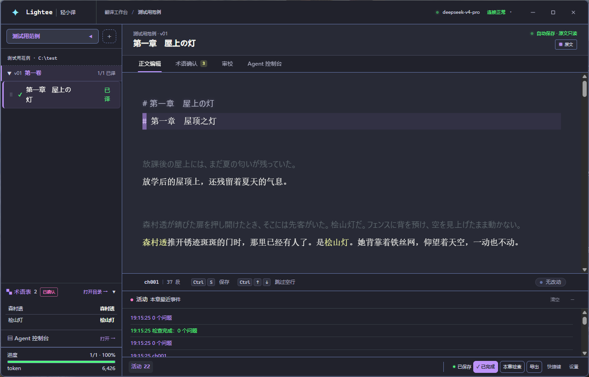

<div align="center">


# 轻小译 Lightee

AI Agent 辅助翻译的日文轻小说工作台


</div>

用 AI Agent 工作流解决轻小说机翻的术语问题，让 AI 高效打底，译者专注精修。

支持导入、逐章翻译、双语对照修改、流畅编辑、基础审校、快捷导出。



---

## 安装

**Scoop** 命令行安装

```powershell
scoop bucket add lightee https://github.com/hirovel/scoop-lightee
scoop install lightee
```

**直接下载**：[Releases](https://github.com/hirovel/lightee-translator/releases) 下载 `Lightee-0.10.0-win-x64-setup.exe`。免安装版是 `-portable.exe`。

注：安装包没有代码签名证书，Windows 会弹「已保护你的电脑」。

翻译需要一个 AI 服务商的 API Key，在设置内填写。Key 经 Windows DPAPI 加密后存在本机来保证安全性。

---

## 完整卸载

卸载默认保留你的设置与翻译历史，重装后可以接着用。要连数据一起清除：

```powershell
& "$env:LOCALAPPDATA\Programs\Lightee\Uninstall Lightee.exe" /S --delete-app-data
```

Scoop 装的：

```powershell
scoop uninstall lightee; Remove-Item -Recurse -Force $env:APPDATA\Lightee
```

Lightee 只占磁盘上两个位置：程序在 `%LOCALAPPDATA%\Programs\Lightee`，数据全部在 `%APPDATA%\Lightee`（设置、API Key、调用历史、日志）。译稿工作区在你自己选的目录里，以上两种方式都不会动它。

---

## 从源码构建

```powershell
pnpm install
pnpm test
```

```powershell
cd apps/electron
npm run package:win
```

产物在 `apps/electron/release/`。

---

如果喜欢请给我点一个星，非常感谢，这对我来说很重要！

<div align="center">
<sub>AGPL-3.0-only · 见 <a href="LICENSE">LICENSE</a></sub>
</div>
